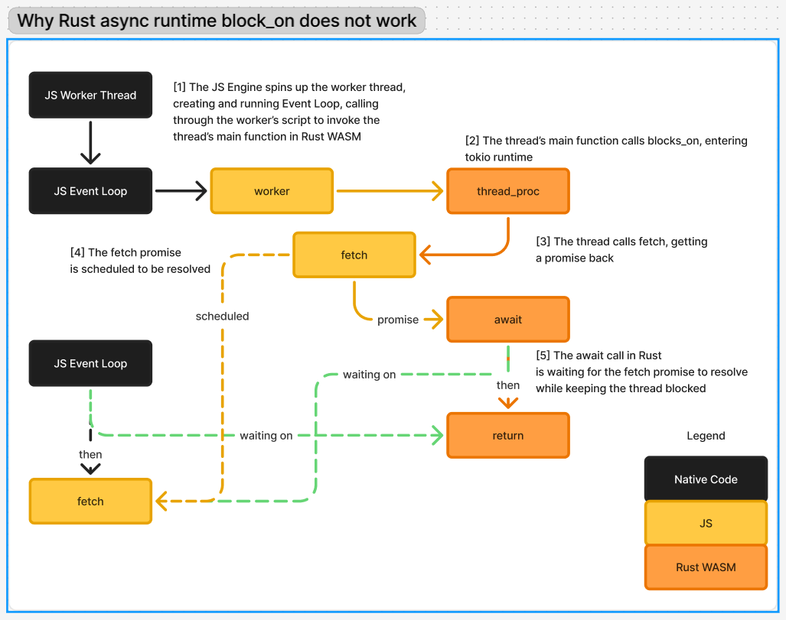
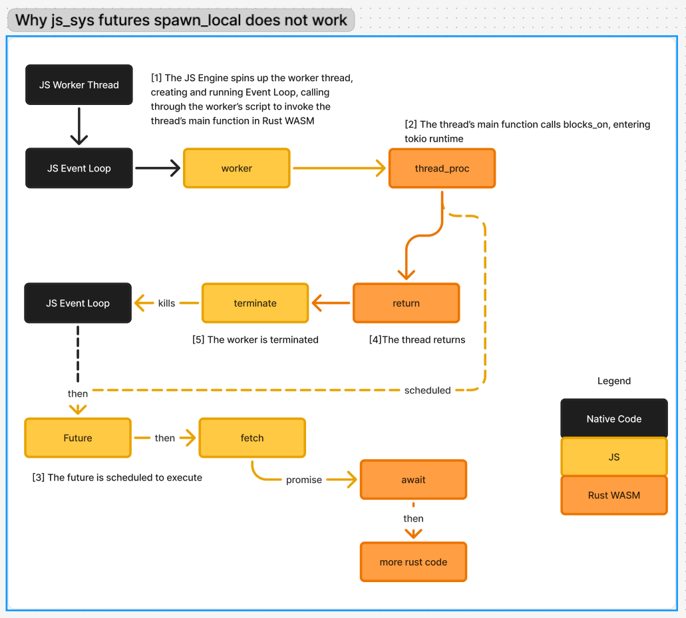

# Working with Async code

> [!IMPORTANT]
> 
> This chapter covers caveats when spawning a future as a thread using the 
> `spawn_async` API in this library. It is not a tutorial for async Rust. <!-- TODO: link `spawn_async` to docs.rs fn.spawn_async.html once published -->
> Basic understanding of async Rust is required.

> [!CAUTION]
> Async code also requires extreme caution when dealing with panics
> and unhandled rejection!
>
> Please refer to [Async Panics](./panic.md#async-panics) after reading the sections below

## When an async thread is required
If we only look at the Rust code, it's hard to imagine why the thread needs to be
async. After all, the standard library does not have a method to spawn
a future as a thread:
```rust
// spawn a thread
let thread = std::thread::spawn(move || {
    // code here executes in a separate OS thread
    // while sharing memory with other threads in the same process

    // Want async? use an async runtime such as tokio!
    tokio::runtime::LocalRuntime::new()
        .unwrap().block_on(async move {
            /* async rust code */
        });

    // when the thread is done, it's done for good - the OS
    // may reclaim (destroy) the resources of this thread
});
```
However, if we zoom out to include the *JS side*, we will see some problems
with synchronous threads. Let's brainstorm this together: to make the code less verbose, suppose we import
this function from the JS side with `wasm_bindgen`:

```javascript
async function fetch_text(url) {
    const response = await fetch(url);
    const text = await response.text();
    return text;
}
```

```rust

#[wasm_bindgen]
extern "C" {
    fn fetch_text(url: &str) -> Promise;
}

let thread = wasm_bindgen_spawn::spawn(move || {
    // code here executes in a separate worker context
    // while sharing memory with other threads in the same process

    // What if we need to wait for some async JS API?
    fetch_text("https://github.com");
    // what now?

    // when the thread is done, it's done for good - the JS
    // worker will be terminated
});
```

What if, like in standard Rust, we involve an async runtime?


```rust

#[wasm_bindgen]
extern "C" {
    fn fetch_text(url: &str) -> Promise;
}

let thread = wasm_bindgen_spawn::spawn(move || {
    // code here executes in a separate worker context
    // while sharing memory with other threads in the same process

    // Want async? use an async runtime such as tokio!
    let result = tokio::runtime::LocalRuntime::new()
        .unwrap().block_on(async move {
            let js_string = fetch_text("https://github.com").await.unwrap();
            let rs_string: String = /* cast omitted */ js_string;
            rs_string
        });

    // when the thread is done, it's done for good - the JS
    // worker will be terminated
});
```

This **does not work**! To see why, let's trace the process:



1. The JS worker spins up and invokes the thread's main function.
2. The thread enters an async runtime within Rust.
3. With the async runtime, the `fetch` API in JS is called.
4. The `fetch` API starts to do the network calls (implementation depends on the JS runtime/engine).
5. The `.await` in Rust invokes the `IntoFuture` implementation of `Promise`,
   which is rather simple: it registers the *waker* of the future as the `resolve`
   and `reject` callbacks on the `Promise` object. When the promise is done,
   the waker notifies the runtime in Rust to poll the future again.
- Now comes the issue:
  - For a promise to resolve, the control must be yielded back to the JS event loop.
    It cannot happen while the JS event loop is executing JS code.
    The JS event loop is in a context that invoked the thread's main function,
    which must finish before it can do anything else that's scheduled.
  - However, the `block_on` implementation parks the thread until
    some future can be polled again (notified by the waker). It's waiting
    for the JS event loop to resolve the future and wake up the async runtime
    in Rust.
- We have a dead lock!


So blocking on an async runtime does not work, but what if we use the `js_sys::futures`
runtime, which is backed by Promises and by design driven co-operatively with
the JS event loop?

```rust

#[wasm_bindgen]
extern "C" {
    fn fetch_text(url: &str) -> Promise;
}

let thread = wasm_bindgen_spawn::spawn(move || {
    // code here executes in a separate worker context
    // while sharing memory with other threads in the same process

    // Want async? Maybe use js_sys::futures?
    js_sys::futures::spawn_local(async move {
        let js_string = fetch_text("https://github.com").await.unwrap();
        let rs_string: String = /* cast omitted */ js_string;
        // wait.. how do we return the result?
    });

    // when the thread is done, it's done for good - the JS
    // worker will be terminated
});
```

Well, this time, there's no dead lock, but the future also does not execute at all.
Let's again trace the execution.



1. The JS worker spins up and invokes the thread's main function.
2. The thread spawns a `JsFuture`, which is backed by a `Promise`.
   - The implementation is as follows: The future will be `poll`-ed in Rust
     with a waker. If it returns `Poll::Pending`, the future must store the waker
     so it can notify the runtime to poll the future again when ready (this is 
     just normal async Rust stuff, not JS-specific). In this runtime, when
     the waker is notified, it will then schedule to poll the future again
     after yielding to the JS event loop.
3. JS Promises are *eager*: the promise is immediately scheduled onto the JS
  event loop to execute.
4. Then the thread's main function finishes
5. The worker is terminated
6. Scheduled futures never get to run before the worker dies!


Now we see the full picture. The only way around this is to make the thread's main function `async`
to allow the JS event loop to do other things if the main function needs to `await`.

> [!NOTE]
> Q: Wait! But you said "terminate the worker" when the thread is finished.
> What if we just don't terminate the worker when the thread's main function
> returns?
> 
> A: Well, we still have to kill the thread when the main function finishes,
> otherwise the worker will just be left alive idling.
> 
> Q: Then we can register a callback so when the thread is finished, it can
> then terminate the worker...
>
> A: Yes! And that's exactly what we do!
> ```javascript
> invoke_thread_main().then(() => terminate_worker());
> // is exactly the same as
> await invoke_thread_main();
> terminate_worker()
> ```

## `Send` bounds
You may have noticed that the `spawn_async` API does not take an `impl Future`,
but an `impl FnOnce() -> impl Future`. This is because the thread's main function
and the thread's future need to satisfy different *trait bounds* for the `Send`
trait.

If the `spawn_async` API requires `impl Future + Send`, it will be basically unusable
for what it's meant to be used with:

```rust
wasm_bindgen_spawn::spawn_async(async move {
    // hmm let's do something with JS
    let js_value = get_value_from_js();
    call_some_function_in_js(js_value).await;
    // BOOM!                           ^ future is not Send!
})
```

Recall that the `Send` trait is a marker trait for a type to be safe to send
across thread boundaries. Read more at [Rust API Docs](https://doc.rust-lang.org/std/marker/trait.Send.html).

Now consider `JsValue`, a concrete example of a type that does not implement `Send`.
A `JsValue` is literally a reference to a value in the JS context. Obviously, you cannot reference the same value
in other JS contexts (i.e. other threads).

For a future to implement `Send`, it must be allowed to be sent to another thread
to continue execution (even in the middle of the execution, at `await` points).
But in our case, the future is only ever spawned locally on the thread's JS event loop,
so it actually does not require `Send`. However, if we drop the `Send` requirement,
it will be even more disastrous:

```rust
// hmm let's do something with JS
let js_value = get_value_from_js();
wasm_bindgen_spawn::spawn_async(async move {
    call_some_function_in_js(js_value).await;
    // BOOM!                   ^ this is a reference that doesn't exist in this thread
})
```

As mentioned earlier, a `JsValue` is a reference to an object in the current
JS context. You cannot reference it in another JS context. So it's not safe
to drop the `Send` requirement completely.

Therefore, we resort to
```
impl (FnOnce() -> impl Future) + Send
```

This means:
- The thread's main function needs to be `Send`
- It will return a future to continue to do async work locally in the spawned thread.
  This async work does not need to be `Send`.
- But if the future captures anything from the spawning thread, it also requires
  the `Send` closure to capture it, which requires that all captured variables be `Send`.


