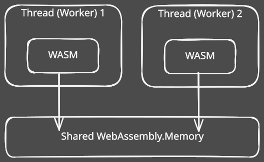
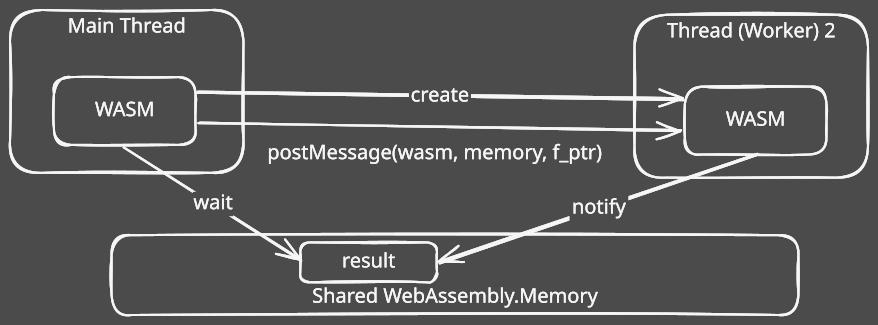
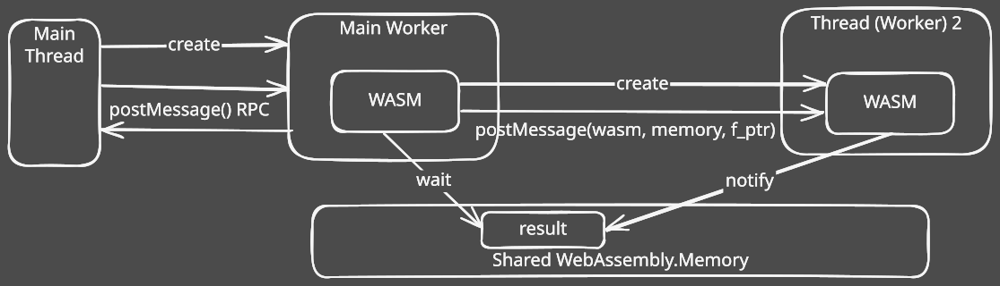
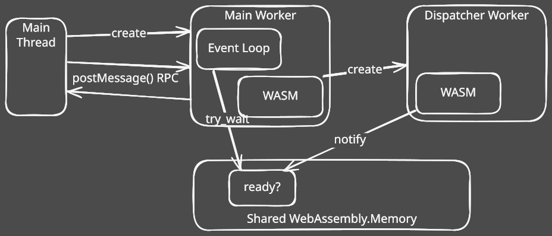
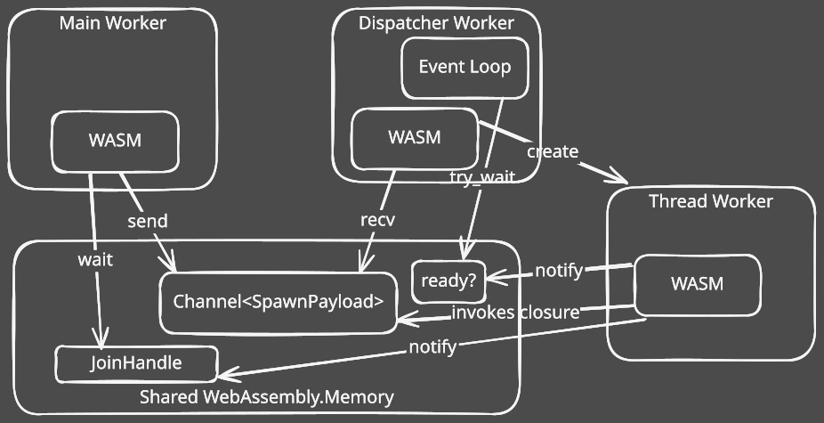

# Design Blog

> [!IMPORTANT]
> *Written on `2024-10-06` after first version of this crate.*
>
> *This is not a tutorial for the crate - please see other chapters of this book,
>  or checkout the [Playground](https://wbgspawn-playground.pistonite.dev) to this
>  this crate in action*.

## Motivation
The dream is to be able to use `std::thread::spawn` in WebAssembly and things "just work".
However, [this is still far from working for the `wasm32-unknown-unknown` target](https://github.com/rust-lang/rust/issues/77839).
Meanwhile, the underlying features required to implement threads in the browser environment are stable enough
that I want to look into implementing this myself.

## Background
The backbone of the design is explained in ["Multithreading Rust and Wasm"](https://rustwasm.github.io/2018/10/24/multithreading-rust-and-wasm.html).
Essentially:
1. [Web Workers](https://developer.mozilla.org/en-US/docs/Web/API/Web_Workers_API)
are "threads" in the browser environment.
2. Instead of communicating with `postMessage`, we want to utilize the
WebAssembly [threads proposal](https://github.com/WebAssembly/threads/blob/master/proposals/threads/Overview.md)
to share memory between threads, using a shared `WebAssembly.Memory` object, which is backed by a [`SharedArrayBuffer`](https://developer.mozilla.org/en-US/docs/Web/JavaScript/Reference/Global_Objects/SharedArrayBuffer).
3. Rust toolchain already has (limited) support for synchronization primitives using the `atomics` feature:
    - [`Condvar`](https://github.com/rust-lang/rust/blob/master/library/std/src/sys/wasm/condvar_atomics.rs)
    - [`Mutex`](https://github.com/rust-lang/rust/blob/master/library/std/src/sys/wasm/mutex_atomics.rs)
    - [`RwLock`](https://github.com/rust-lang/rust/blob/master/library/std/src/sys/wasm/rwlock_atomics.rs)

<div style="display:flex;align-items:center;flex-direction:column">

    <span><i>
        Illustration: shared memory between worker threads
    </i>
    </span>
</div>


## Starting Point
Since the API is to mimic `std::thread::spawn`, let's first look at that:

```rust
// spawn a thread, returning a std::thread::JoinHandle for it
let handle = std::thread::spawn(|| {
    println!("Hello from a thread!");

    return 42;
});
// wait for thread to finish
let result = handle.join().unwrap();
assert_eq!(result, 42);
```

To model this pattern with Web Workers, we need to:
- On the main thread, create a web worker.
- Send the WASM module information to the worker, so it can instantiate the module.
- Send the shared memory object to the worker to allow it to access the shared memory.
- Send the closure as a raw pointer to the worker via `postMessage`
- The worker instantiates the WASM module and connects it to the shared memory.
- The worker will then call the closure and write the returned result to the shared memory.
- The main thread will wait with an atomic instruction when `join` is called
- The worker will call `notify` when the thread is done.

<div style="display:flex;align-items:center;flex-direction:column">

    <span><i>
        Illustration: Idea 1
    </i>
    </span>
</div>

### Problem 1: Main thread cannot block.

The web standard [does not allow the main thread to block](https://developer.mozilla.org/en-US/docs/Web/JavaScript/Reference/Global_Objects/Atomics/wait).
When the above is implemented, we get `TypeError` when trying to call `join`.

While this is inconvienient, it is not a big problem. The web page's main thread
needs to handle the UI updates, so we probably shouldn't block it anyway.
If multithreading is needed in the WASM module, it makes sense to first
initialize it in a Web Worker and use it with Remote Procedure Call (RPC) pattern
from the main thread with async/await.

<div style="display:flex;align-items:center;flex-direction:column">

    <span><i>
        Illustration: Idea 1, Problem 1 fixed
    </i>
    </span>
</div>

### Problem 2: Deadlock

After fixing the main thread blocking issue, we quickly observe that
a deadlock is created when calling `join`, and the worker is never started.

This is because in most browsers (tested in Chrome/Edge/Firefox), workers
don't start executing immediately after construction, but are queued up
in the event loop. Therefore, we must wait until the worker starts executing
the closure before we can start blocking.

This requires us to interface with the event loop with a Promise
that resolves when the worker is ready, something like:
```javascript
///// main thread
const promise = new Promise(resolve => {
    const worker = new Worker('worker.js');
    worker.onmessage = (e) => {
        if (e.data === 1) {
            resolve();
            worker.postMessage(/*...*/)
        }
    };
});
promise.then(() => {
    // start blocking
});

///// worker.js
importScript(/* wasm_bindgen output */);
self.onmessage = async (e) => {
    const { /*...*/ } = e.data;
    // initialize wasm module and shared memory
    await wasm_bindgen(/*...*/);
    // calling into wasm to execute the closure
    await wasm_bindgen.__worker_main(/*...*/);
};
self.postMessage(1);
```

### Problem 3: Deadlock (again)
As it turns out, it's not just the `Worker` constructor that queues up
the execution in the event loop. `postMessage` also doesn't make the other side
receive the message immediately. Essentially, we run into the dilemma:

1. The spawning thread can only block after it knows the worker will execute the closure.
2. When the worker knows it will execute the closure, it needs to let the spawning thread know,
which is an async operation

## The Issues
The solution above to problem 2 has 2 major problems that I don't like:
1. It requires `spawn` and `join` be async, which propagates and
makes everything async in the Rust code<sup>1</sup>. This requires interop
with JavaScript's Promise (for example, using `wasm-bindgen-futures`),
and makes the API more cumbersome and doesn't feel like `std::thread`.
2. Limitation of how `Worker` constructor and `postMessage` works in the browser
defeats multithreading entirely. If everything is properly synchronized, the
threads can only run one at a time.

When I realized this, I stopped and went back to the drawing board to rethink the designl

And the solution? - Don't use `postMessage`!

## The Dispatcher
When the worker is created, we have to use `postMessage` to initiate the communication.
But once the WASM module is initialized, we can start using shared memory to communicate
the rest to the worker, which does not have the same restrictions with regards to the event loop.

So, I came up with the Dispatcher. It is a dedicated Web Worker that is just used
to spawn threads. A one-time cost is paid to create the dispatcher
and wait for it to be ready using the event loop. 

<div style="display:flex;align-items:center;flex-direction:column">

    <span><i>
        Illustration: Creating the Dispatcher
    </i>
    </span>
</div>

Once the dispatcher is ready, the `spawn` and `join` flow is as follows:
1. The spawning thread calls `spawn` with a closure and can immediately block
2. The dispatcher receives a payload (which contains the closure and some channels)
3. The dispatcher creates a new worker and wait for it to start using the JS event loop<sup>2</sup>
4. Once the worker thread is running, the dispatcher can call `recv` and block again
5. Once the worker is done, it notifies the `JoinHandle` in the spawning thread to unblock it.


<div style="display:flex;align-items:center;flex-direction:column">

    <span><i>
        Illustration: Spawning new workers with the Dispatcher
    </i>
    </span>
</div>

This is the final design that I went with.

## Other Limitations

### Performance
Because each new thread (i.e. Worker) requires initializing the WASM module and
asynchronous communication via `postMessage`, it is VERY slow to spawn a new thread.
In my testing, it could take hundreds of milliseconds.

However, after the threads are up and running, sending messages between them is very fast using
channels. This is because we no longer rely on `postMessage`. The speed is dependent on
how the Web Workers are scheduled by the browser/runtime.

Fortunately, the same is true for threads on any platform and a solution already exist
- Reuse the threads with a pool. This is not implemented in this library, but it 
should be easy to do so. One of the examples shows how you can do it yourself.

> [!TIP]
> *Edit on 2026-08-24*
>
> Please see the `example_arc_atomic_pooled` example in the [Playground](https://wbgspawn-playground.pistonite.dev)
> for a basic concept of sending a large number of tasks to a small number of threads. Note
> that it is not a robust pool implementation like the `threadpool` crate or the `rayon` crate.

### Limit on Number of Workers
It is worth noting that Firefox limits the number of workers per domain to 20 by default,
which could be lower than the the number of cores. The Dispatcher design allows
extra workers to be queued up and started when the previous worker is done. However,
if the limit is reached and all workers are blocked by something needed in an extra
worker, a dead lock will happen.

~~Firefox also appears to report `navigator.hardwareConcurrency` as the number of physical cores,
whereas Chrome reports it as number of logical cores on CPUs with SMT/Hyperthreading.~~ This appears
to be fixed, at least on my machine.

### Panic, unwind, poison
> [!TIP]
> *Edit on 2026-08-24*
>
> As of `wasm-bindgen-spawn 0.0.7`, unwinding is now supported. Please the setup guide.
> The info in this section is still true other than the fact that the exception handling proposal
> has been standardized.

Unwinding is Rust's mechanism for recovering from panics. It's not supported for `wasm32-unknown-unknown` target, so the panic behavior is `abort`. This means any panic will leave the WASM module in an inconsistent state and it should not be used again.

The implementation puts one thread per worker, and panicking/aborting from a thread will also terminate that worker. So it's safe to panic.

However, because there's no unwinding, mutex guards will not [poison](https://doc.rust-lang.org/nomicon/poisoning.html) when the thread panics. Instead, the guard is not dropped and any subsequent access to the mutex will dead lock.

This can be improved when the [exception handling proposal](https://github.com/WebAssembly/exception-handling/blob/master/proposals/exception-handling/Exceptions.md) becomes stable and enabled by default in most browsers, from when we could catch the panic with unwinding and even send the panic payload back to the thread that called `join`.

## Thanks
- [`wasm-mt`](https://github.com/w3reality/wasm-mt) project for the links they put in the README
  which sparked my interest to do a deep dive and ultimately create this project.
- [`wasm-bindgen-rayon`](https://github.com/RReverser/wasm-bindgen-rayon/blob/main/README.md) project, which helped me understanding the prerequisites like [Cross-Origin Isolation](./setup.md#cross-origin-isolation)
- [Ciantic's experimental work](https://github.com/Ciantic/rust-shared-wasm-experiments) - very helpful in getting a basic example up and running
- The [`wasm-bindgen`](https://github.com/wasm-bindgen/wasm-bindgen) and related projects, and everyone else for the work put in to make Rust+WASM what it is today.
- You - for reading this blog post.

---

- <sup>1</sup>: Author's note 2026-08-24: after implementing async threads in 0.0.7,
it might have been a good idea to make everything async.
- <sup>2</sup>: Author's note 2026-08-24: When implementing 0.0.7 I realized
`tokio::sync::mpsc` async channels works with co-operative (async) receives,
and is already needed so the dispatcher can handle worker panic termination
while waiting for threads to be sent. So this part will get better when the next
time I work on this project again.
