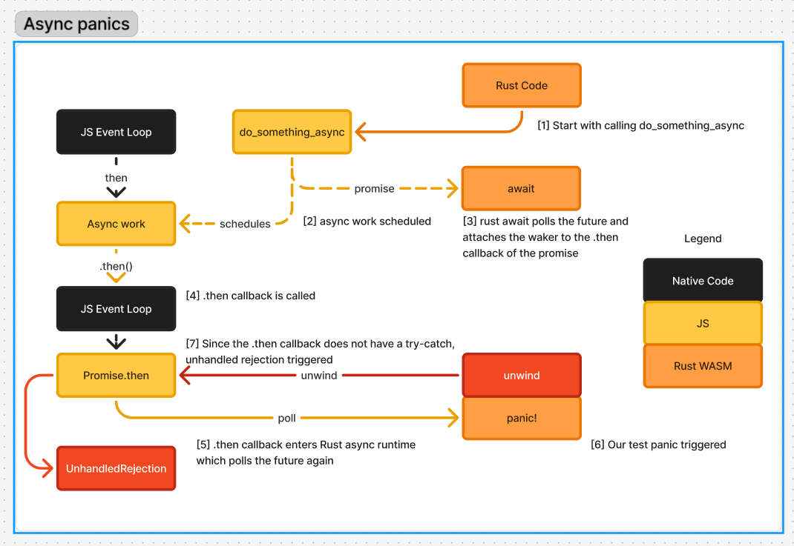

# Working with Panic

> [!IMPORTANT]
> 
> This chapter covers caveats when a thread spawned with this library panics.
> It is not a tutorial about panicking in Rust, nor a tutorial about unwinding
> or `UnwindSafe`-ty.
>
> This is also not a tutorial about how panics work in WASM or `wasm-bindgen`.
> Please refer to [Catching Panics](https://wasm-bindgen.github.io/wasm-bindgen/reference/catch-unwind.html)
> and [Handling Aborts](https://wasm-bindgen.github.io/wasm-bindgen/reference/handling-aborts.html)
> in the `wasm-bindgen` guide.

In Rust, panic is a feature that triggers alternate control flow, similar to exceptions in other languages.

## Abort vs. Unwind
Historically, when `panic=unwind` was not supported, panics triggered the `unreachable` instruction
in WASM, which causes a dreaded `Runtime Error: unreachable` in JS:

```javascript
// JS
try {
    call_rust()
} catch(e) {
    console.error(e);
}
```
```rust
// Rust
fn call_rust() {
    std::panic::catch_unwind(|| {
        panic!("wooo");
    });
}
```
Output:
```
Runtime Error: unreachable
<some unreadable stack trace>
```

Historically, the debuggability issue is solved by using a panic hook to print the panic information
before `unreachable` is triggered. However, it does not fix the fact that a panic hard-aborts the WASM instance, meaning:
- Variables are not dropped. Memory will leak.
- Mutexes are not poisoned. If a thread panics while holding a mutex, the mutex will never be released.
- `catch_unwind` has no effect.
- The WASM instance is generally left in a state that's not safe to call. If you call it anyway,
  it might be fine, or it might fail with disaster.

With `panic=unwind` however, things "just work":
- Variables are dropped during unwind, cleaning up memory.
- Mutexes are also dropped during unwind, causing them to poison rather than lock forever.
- `catch_unwind` may be used to pause the unwind, inspect the payload, and optionally recover.
- The WASM instance is not aborted
- In `wasm-bindgen`, unwinds across the JS-Rust boundary manifest as a `PanicError`.

Note, however, that hard aborts can still happen even when `panic=unwind`, meaning this library
needs to handle `abort`s if `panic=abort` and *both* `abort`s and `unwind`s if `panic=unwind`.


## Panic from a synchronous thread
When a synchronous thread panics, the join handle will reliably detect the panic, even in the case
of `panic=abort`.

```rust
let thread = wasm_bindgen_spawn::spawn(move || {
    panic!("test!");
}
assert!(thread.join().is_err());
```

The difference is the panic payload:
- If `panic=unwind`, the original panic payload is delivered to the join handle, meaning
  you can inspect the error message, etc.
- If `panic=abort`, or the WASM instance hard-aborted in `panic=unwind`, the panic information is lost. The join handle gets a generic error
  `thread panicked or aborted`

> [!TIP]
> You can observe the difference in behavior in the `example_join_handle` and `example_mutex_poison`
> examples in the [Playground](https://wbgspawn-playground.pistonite.dev)

## Async panics
> [!NOTE]
> Please refer to [Working with Async code](./async.md) for the `spawn_async` API

When an asynchronous thread panics, it is trickier to deal with. To see why, let's consider
the following example:


```rust
#[wasm_bindgen]
extern "C" {
    fn do_something_async() -> Promise;
}
wasm_bindgen_spawn::spawn_async(|| async {
    let _ = do_something_async().await.unwrap();
    panic!("test panic!");
});
```

This panic now cannot be simply handled by wrapping the thread with `std::panic::catch_unwind`.
Let's trace the process to see exactly how this works:



1. We will start from calling `do_something_async` and ignore everything that happened before it for simplicity.
2. `do_something_async` schedules some async work, returning a promise to Rust
3. Rust `await`s the promise by attaching the waker to the promise.
4. When the async work is done, the JS event loop calls the `then` callback on the promise.
5. The future wakes up; The `js_sys::futures` runtime polls the future
6. Rust code panics and starts to unwind.
7. The unwind reaches JS in the `then` callback. Since the callback does not
   wrap the Rust polling with `try/catch`, the exception reaches the JS runtime
   and triggers an Unhandled Rejection.
8. Since the polling never returned, the future is leaked, and the main thread's future
   will never finish, leaving the worker and the thread hanging.
> [!NOTE]
> In native JS runtimes, an unhandled rejection will kill the worker directly, leading
> to a memory leak in Rust and the thread hanging. In browsers, unhandled rejections are ignored.

> [!NOTE]
> The `JsFuture` implementation does have a `.catch` callback registered. However, it does
> not have a try-catch surrounding the code *inside* the callback itself. Think of it this way:
>
> ```javascript
> do_something_async()
>   .then(() => {
>      wake_rust_future() // no try-catch here!
>                         // the catch below will not catch exceptions here
>   })
>   .catch(() => /* ... */);
> ```
> In reality the async stack is a bit more complicated, but our point is already clear with this model.

> [!NOTE]
> `js_sys::futures` inserts `catch_unwind` internally to catch panics in Rust,
> but it only creates a `PanicError` from it and throws it to JS. This is the right thing
> to do in the `js_sys` level, but it does not help here.

While there is not a single "right" behavior for async panics, this library took inspiration from `tokio`,
whose runtime captures any async panic and reports it to the `JoinHandle` for the task.
This library does the same:
- A thread-local "worker runtime" is installed to allow notifying the join handle and terminating the worker anywhere
  within Rust.
- The thread's main future is double-wrapped with JS `try/catch` and Rust `catch_unwind`.
  - if `panic=unwind` and a Rust unwind is caught, the panic payload is transmitted to the join handle
    and the worker is then terminated.
  - if a hard abort is caught by the JS `try/catch`, Rust code is no longer safe to call,
    so the worker is terminated directly from JS code, without returning the control to Rust again.
    In this case, the worker notifies the thread dispatcher before termination and lets the dispatcher
    notify the join handle about the hard panic.

With this, you can safely run this code and ensure the worker does not hang forever, in both `panic=abort`
and `panic=unwind`. In `panic=unwind` you will also get the panic message in the `Err` returned.

```rust
#[wasm_bindgen]
extern "C" {
    fn do_something_async() -> Promise;
}
let handle = wasm_bindgen_spawn::spawn_async(|| async {
    let _ = do_something_async().await.unwrap();
    panic!("test panic!");
});
assert!(handle.join().is_err());
```

## Async panics in detached tasks
A detached task/thread refers to a task that is still running, but cannot be joined,
for example due to the `JoinHandle` being dropped. You can do this in many frameworks,
for example:
- In standard Rust, calling `std::thread::spawn` and dropping the `JoinHandle`.
- In Tokio, calling `tokio::task::spawn` and dropping the `JoinHandle`.
- In JS, spawning a future without `await`-ing it, attaching `.then`/`.catch` callbacks, or keeping
  a reference to that promise.

The last point is what we need to worry about here. You can spawn a Rust future
onto the JS event loop using `js_sys::futures::spawn_local`. This future will continue
to be polled, but `js_sys` does not provide a way to join the future, nor does it
wrap polling the future with `try/catch`. So spawning a future that panics using
this API will still result in the thread hanging.
> [!TIP]
> You can experience this with the `example_async_panic` example in the [Playground](https://wbgspawn-playground.pistonite.dev)
> when `panic=abort`.

```rust
let handle = wasm_bindgen_spawn::spawn_async(|| async {
    js_sys::futures::spawn_local(async move {
        panic!("test panic!");
    })
    /* here we might need to keep the thread alive for longer until
       the panic is triggered. for example await on a setTimeout */
});
```

What happens in this case depends on the runtime:
- In native runtimes, the unhandled rejection causes the worker to terminate,
  so the thread will hang forever.
- In browsers, unhandled rejections are ignored, so the panic is ignored.
  If other futures continue to execute Rust code when `panic=abort`, it's not safe
  and you may observe other weird errors/aborts.

To mitigate this, you should use `wasm_bindgen_spawn::spawn_local` in worker threads.
This spawns the future wrapped with the hooks into the "worker runtime" described
above, and will reliably terminate the worker and notify the join handle when
panics are detected.

```rust
let handle = wasm_bindgen_spawn::spawn_async(|| async {
    wasm_bindgen_spawn::spawn_local(async move {
        panic!("test panic!"); // during the unwind/abort of this panic,
                               // the worker is terminated and the panic
                               // is transmitted to the join handle
    })
    /* here we might need to keep the thread alive for longer until
       the panic is triggered. for example await on a setTimeout */
});
```

> [!WARNING]
> Note this is still not a bullet-proof vest against threads hanging. Other unhandled rejections
> can still happen and there is not a one-size-fits-all way to deal with them. For example:
> ```rust
> wasm_bindgen_spawn::spawn_async(|| async {
>    Function::new_no_args("void (async function() { throw new Error('hi') })()")
>       .call0(&JsValue::undefined());
> });
> ```
> The code above triggers a harmless unhandled rejection. In browsers, it's ignored;
> in native runtimes, the worker is terminated and the thread hangs.
>
> In the future this crate may install an unhandled rejection handler or
> provide some utilities to run custom setup JS in the worker's
> context to deal with these cases.
